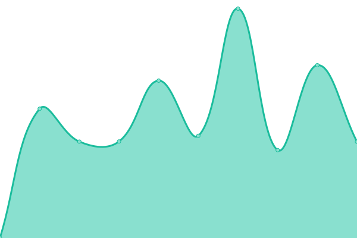
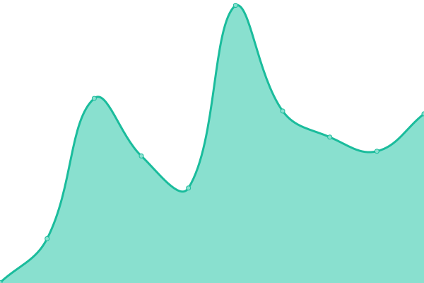

# [📈 Live Status](https://uptime.siesta.cat): <!--live status--> **🟥 Complete outage**

This repository contains the open-source uptime monitor and status page for [Alie](https://status.siesta.cat), powered by [Upptime](https://github.com/upptime/upptime).

With [Upptime](https://upptime.js.org), you can get your own unlimited and free uptime monitor and status page, powered entirely by a GitHub repository. We use [Issues](https://github.com/AlieNeon/uptime/issues) as incident reports, [Actions](https://github.com/AlieNeon/uptime/actions) as uptime monitors, and [Pages](https://uptime.siesta.cat) for the status page.

<!--start: status pages-->
<!-- This summary is generated by Upptime (https://github.com/upptime/upptime) -->
<!-- Do not edit this manually, your changes will be overwritten -->
<!-- prettier-ignore -->
| URL | Status | History | Response Time | Uptime |
| --- | ------ | ------- | ------------- | ------ |
|  [Stickee](https://stickee.siesta.cat) | 🟥 Down | [stickee.yml](https://github.com/siesta-cat/upptime/commits/HEAD/history/stickee.yml) | 

 576ms
     
 | 

<a href="https://status.siesta.cat/history/stickee">58.89%</a>
    

|  [Siesta Write](https://write.siesta.cat) | 🟥 Down | [siesta-write.yml](https://github.com/siesta-cat/upptime/commits/HEAD/history/siesta-write.yml) | 

 878ms
     
 | 

<a href="https://status.siesta.cat/history/siesta-write">58.90%</a>
    

|  [RSS Reader](https://rss.siesta.cat) | 🟥 Down | [rss-reader.yml](https://github.com/siesta-cat/upptime/commits/HEAD/history/rss-reader.yml) | 

 4651ms
     
 | 

<a href="https://status.siesta.cat/history/rss-reader">58.90%</a>
    

|  [Gotosocial Instance](https://social.siesta.cat) | 🟥 Down | [gotosocial-instance.yml](https://github.com/siesta-cat/upptime/commits/HEAD/history/gotosocial-instance.yml) | 

 591ms
     
 | 

<a href="https://status.siesta.cat/history/gotosocial-instance">58.91%</a>
    

|  [Authelia](https://auth.siesta.cat) | 🟥 Down | [authelia.yml](https://github.com/siesta-cat/upptime/commits/HEAD/history/authelia.yml) | 

 733ms
     
 | 

<a href="https://status.siesta.cat/history/authelia">58.91%</a>
    

|  [Ldap](https://ldap.siesta.cat) | 🟥 Down | [ldap.yml](https://github.com/siesta-cat/upptime/commits/HEAD/history/ldap.yml) | 

 1911ms
     
 | 

<a href="https://status.siesta.cat/history/ldap">58.92%</a>
    

|  [Forgejo](https://git.siesta.cat) | 🟥 Down | [forgejo.yml](https://github.com/siesta-cat/upptime/commits/HEAD/history/forgejo.yml) | 

 659ms
     
 | 

<a href="https://status.siesta.cat/history/forgejo">59.21%</a>
    

|  [Vaultwarden](https://vaultwarden.siesta.cat) | 🟥 Down | [vaultwarden.yml](https://github.com/siesta-cat/upptime/commits/HEAD/history/vaultwarden.yml) | 

 588ms
     
 | 

<a href="https://status.siesta.cat/history/vaultwarden">59.22%</a>
    

<!--end: status pages-->

[**Visit our status website →**](https://status.siesta.cat)

## 📄 License

- Powered by: [Upptime](https://github.com/upptime/upptime)
- Code: [MIT](./LICENSE) © [Anand Chowdhary](https://anandchowdhary.com), supported by [Pabio](https://pabio.com)
- Data in the `./history` directory: [Open Database License](https://opendatacommons.org/licenses/odbl/1-0/)
